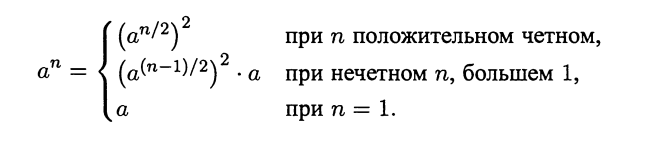
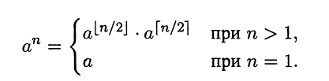

# Метод уменьшения размера задачи (Уменьшай и властвуй)

Данный метод основан на
использовании связи между решением исходной задачи
 и решением меньшего экземпляра той же задачи. Если такая связь установлена, то
её можно использовать либо *сверху вниз* (т.е. рекурсивно), либо *снизу вверх* (без рекурсии).

**Существуют 3 основных метода уменьшения**.  

*Уменьшение на постоянную величину (чаще всего на 1)*.  
При каждой итерации алгоритма размер экземпляра задачи уменьшается (или увеличивается) на единицу. Например, вычисление 
`a^n` для положительный целых показателей степени. Связь между решением исходной задачи и задачи меньшего размера выражается формулой `a^n=a^{n-1}*a`. 
Таким образом, можно решить данную задачу "сверху вниз" с помощью рекурсии:  

*Уменьшение на постоянный множитель (чаще всего на 2)*.  
При каждой итерации размер экземпляра задачи уменьшается на постоянный множитель (или увеличивается). В качестве примера можно вновь рассмотреть задачу возведения в целую положительную степень `a^n`.
Связь в данном случае выражается формулой `a^n=(a^{n/2}^2)` для четных `n` и `a^n=(a^{(n-1)/2})^2*a` для нечетных `n`.
Рекурсивный подход (решение "сверху вниз") в данном случае можно описать формулой:  

Данный алгоритм принадлежит классу `O(log_2(n))`, т.к. при каждой итерации размер задачи уменьшается вдвое ценой не более двух умножений.  
Стоит отметить отличие данного алгоритма от алгоритма, основанного на методе декомпозиции, который работает гораздо медленнее:  

*Уменьшение переменного размера*.  
Величина снижения размера задачи изменяется от итерации к итерации. Примером может послужить алгоритм Евклида для вычисления наибольшего общего делителя:
`gcd(m, n) = gcd(n, m %% n)`